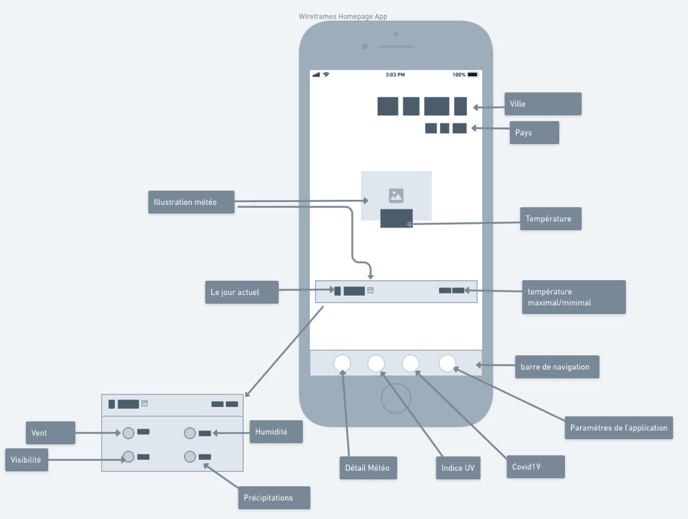
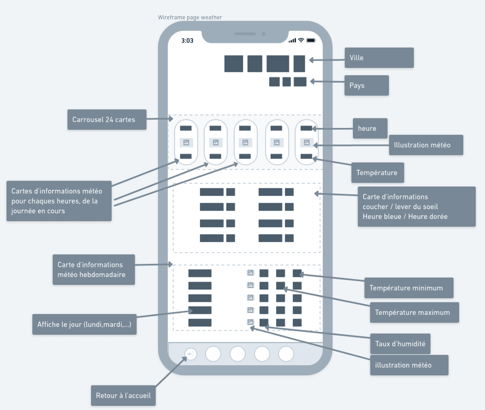
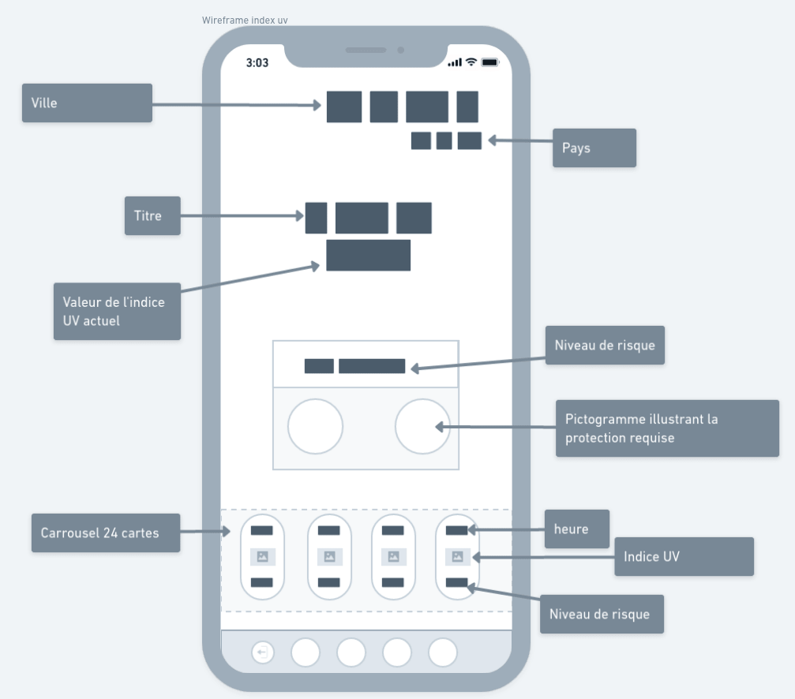
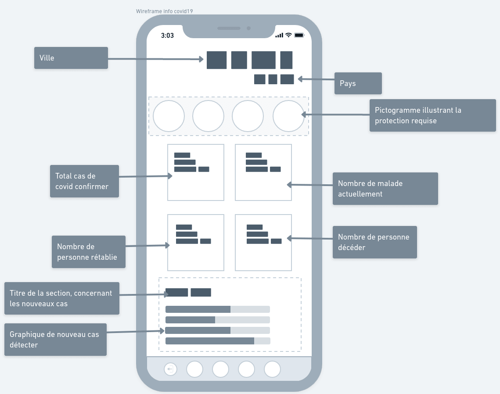
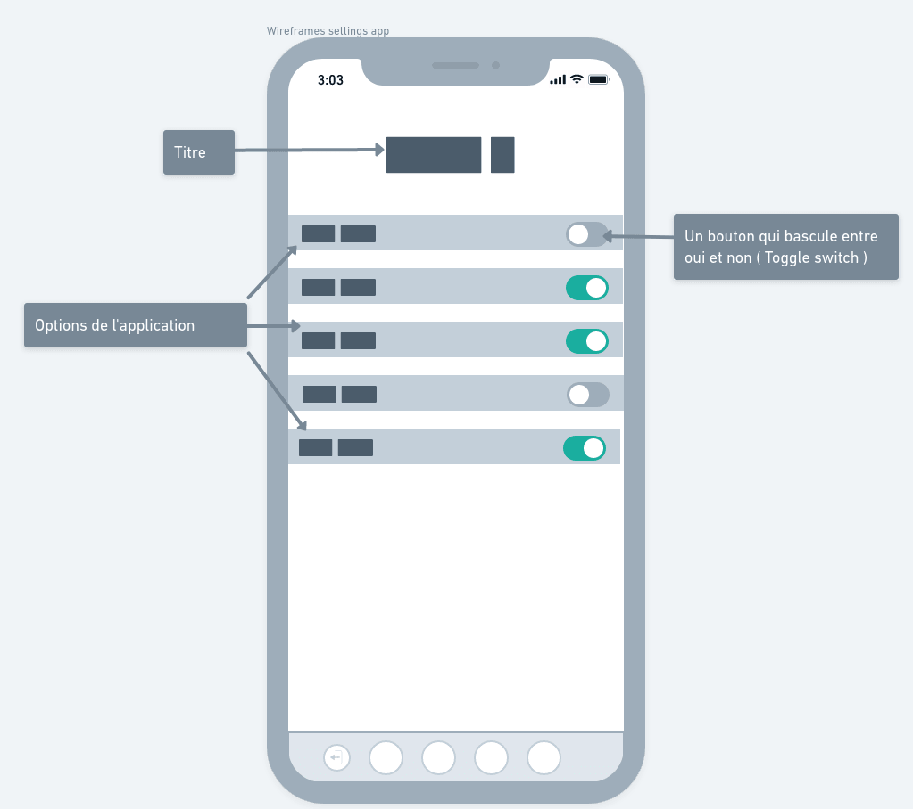

# Modern weather App

**A simple application with a clean design**

---

The technology that will be used to build the user interface, will be react and styled components.
---
we will communicate with 
- [Weather API - stormglass](https://stormglass.io/)  
- [Astronomy API - ipgeolocation](https://ipgeolocation.io/astronomy-api.html) 
- [Health API - vaccovid](https://vaccovid.live/)

here are some inspirations link:

1. [Weather app - Roxy A ](https://www.behance.net/gallery/115578669/Weather-app?tracking_source=search_projects_recommended%7Cweather%20app)
2. [Weather App - Olivia Shoemake](https://www.behance.net/gallery/113183529/Photographers-Assistant-Weather-App?tracking_source=search_projects_recommended%7Cweather%20app)

---

## Conception

> Wireframe Homepage

> Wireframe weather

> Wireframe uv

> Wireframe covid19

> Wireframe settings

